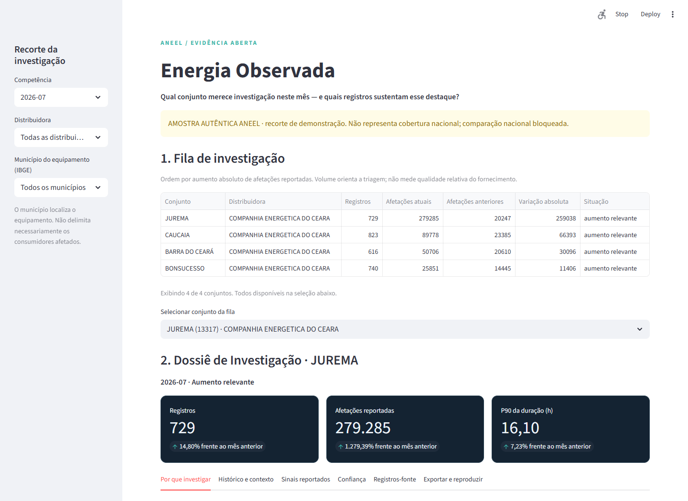

# Energia Observada

**Energia Observada transforma a atualização mensal de interrupções da ANEEL em uma decisão investigável: qual conjunto elétrico deve ser analisado primeiro, por qual mudança observada e com quais registros-fonte.**

O usuário é um analista de qualidade, operação ou inteligência. Ele recebe uma fila transparente e um Dossiê de Investigação com evidências, regras, confiança documental, comparações descritivas e limites explícitos. O produto não atribui causa.

## Demonstração em 60 segundos

No Windows, dê duplo clique em [`abrir-demo.cmd`](abrir-demo.cmd). Ele instala as dependências, publica a amostra e abre `http://localhost:8502`.

```powershell
git clone https://github.com/PedroPaullo/zeki-energia-observada.git
cd zeki-energia-observada
py -3.12 -m venv .venv
.\.venv\Scripts\Activate.ps1
python -m pip install -e ".[test]"
python -m energia_observada demo --launch --port 8502
```

Escolha **JUREMA (13317)** em **2026-07**. A fila mostra 729 registros e 279.285 afetações reportadas, contra 635 e 20.247 em junho. O Dossiê mostra “aumento relevante”, confiança “consistente”, registros de origem e um ZIP verificável.



## Entrega útil

1. Fila mensal por variação absoluta de afetações reportadas.
2. Dossiê por `distribuidora + conjunto + competência + filtros + versões`.
3. Comparação mensal, série própria, pares da distribuidora e, no modo nacional, comparação agregada contra demais distribuidoras com população fixa elegível.
4. ZIP com `dossie.md`, `registros.csv` e `manifesto.json`, verificável sem a sessão Streamlit.

## Dados, validade e limitações

A demonstração é um recorte autêntico de quatro conjuntos ENEL CE: 22.980 registros de janeiro a julho de 2026. O recorte, a consulta e os hashes estão em [`demo/manifest.json`](demo/manifest.json). Ele permite comparação entre pares, mas bloqueia o contexto nacional por não ser uma amostra estatística.

O arquivo nacional validado tem 204.708.716 bytes, SHA-256 `53064794800a0dcff29784c03ccfa84c24f7c290f80c14889d0e950a19f82823`, 6.078.331 linhas, 51 distribuidoras e 3.124 conjuntos. A validação independente está em [`docs/VALIDACAO_NACIONAL.json`](docs/VALIDACAO_NACIONAL.json).

Fonte: [Interrupções de Energia Elétrica nas Redes de Distribuição - ANEEL](https://dadosabertos.aneel.gov.br/dataset/interrupcoes-de-energia-eletrica-nas-redes-de-distribuicao). A cobertura da fonte exclui permissionárias e cooperativas.

- Aumento de interrupções não prova causa.
- Município do equipamento não representa necessariamente consumidores afetados.
- Ausência de dados não equivale à ausência de interrupções.
- Afetações reportadas não são consumidores únicos.
- Comparações são descritivas; equivalência estatística não foi estabelecida.
- O produto apoia investigação, não substitui análise regulatória ou técnica.

## Indicadores e regras

| Indicador | Fórmula | Tratamento |
|---|---|---|
| Registros | contagem de linhas aceitas | não representa eventos únicos |
| Afetações reportadas | `SUM(QtdConsumidoresAfetados)` válida | nulo não vira zero |
| P90 duração | `quantile_cont((fim - início)/hora, 0.9)` | só durações válidas; nunca média de P90 |
| Participação | afetações do conjunto / afetações válidas do filtro | não representa consumidores únicos |

As regras versionadas em [`energia_observada/rules.py`](energia_observada/rules.py) exigem dez registros e durações, 95% de datas válidas; +10% indica deterioração moderada e +25%, aumento relevante. São critérios de triagem, não padrão regulatório nem significância estatística.

Confiança é ordinal: insuficiente, limitada, adequada ou consistente. Ela expõe comparação, histórico, datas, schema, registros usados, nulos/invalidos por campo e integridade. Não é probabilidade ou nota de fornecimento.

## Arquitetura e atualização

`catálogo ANEEL -> bruto imutável + SHA-256 -> PAR1/schema -> Parquet normalizado -> DuckDB -> regras -> fila/Dossiê -> ZIP`

A aquisição registra URL, recurso, UTC, ETag, tamanho, hash, schema, contagens e falhas. O modelo é preparado em staging e só publica após reconciliação; erro preserva a versão anterior. A reaquisição idêntica é idempotente.

```powershell
python -m energia_observada ingest --year 2026
python -m energia_observada transform
python -m energia_observada update --year 2026
python -m energia_observada status
python -m energia_observada verify exports\dossie_07047251000170_13317_2026-07.zip
```

O GitHub Actions agenda a aquisição mensal e valida download, schema, duas execuções e artefatos. Detecção de revisão compara versões locais persistidas, pois o runner do Actions nasce sem histórico.

## Auditoria e documentação

```powershell
python -m pytest
python scripts\validate_national.py
python scripts\validate_browser.py
git diff --check
git log --reverse --oneline
```

Leia [`docs/BRIEF_PRODUTO.md`](docs/BRIEF_PRODUTO.md), [`docs/PRD.md`](docs/PRD.md), [`docs/MATRIZ_REQUISITOS.md`](docs/MATRIZ_REQUISITOS.md), [`docs/RELATORIO_VALIDACAO.md`](docs/RELATORIO_VALIDACAO.md) e [`docs/ROTEIRO_VIDEO.md`](docs/ROTEIRO_VIDEO.md). A cola final é gerada em `output/pdf/cola-video-energia-observada.pdf` por `python scripts\gerar_cola_video.py`.
